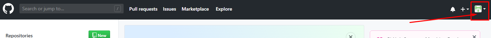
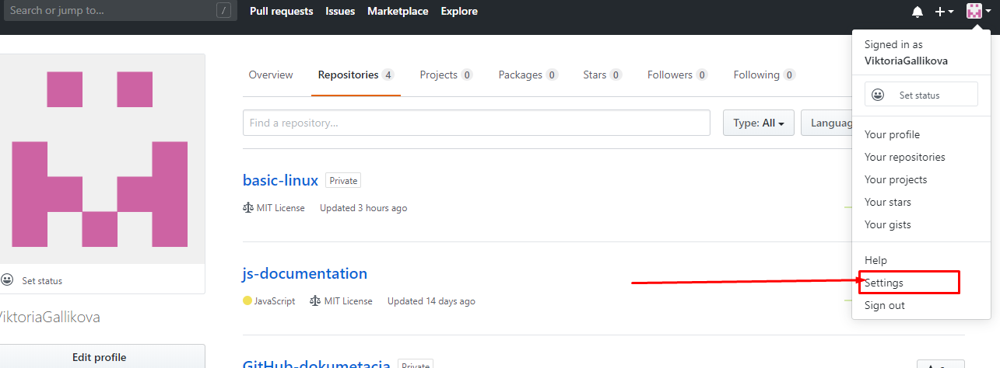
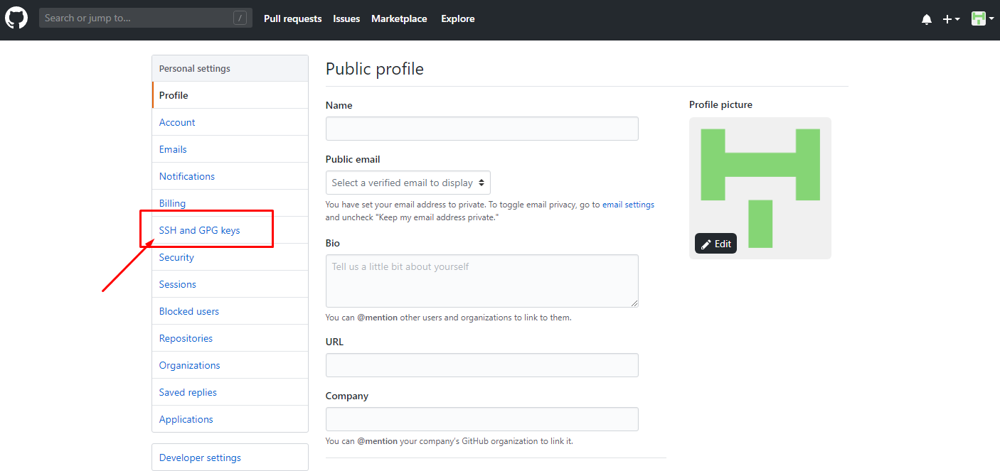
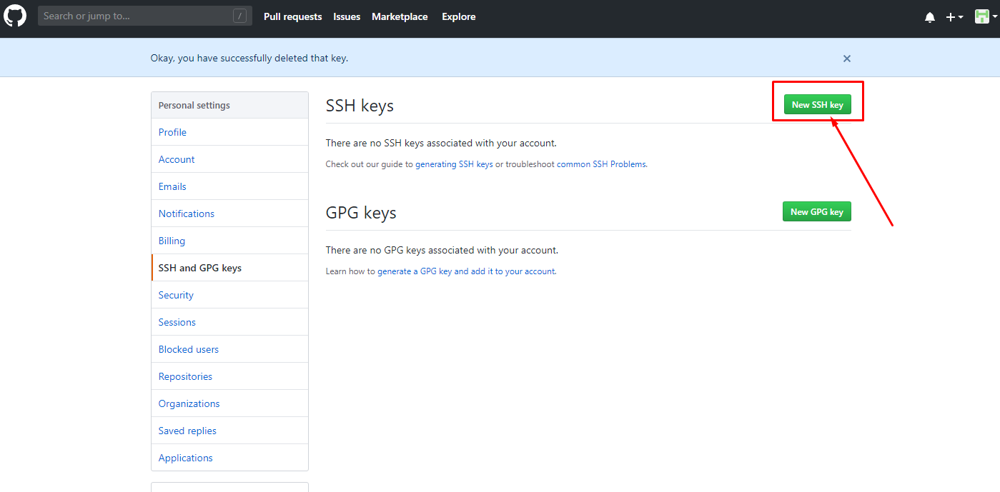
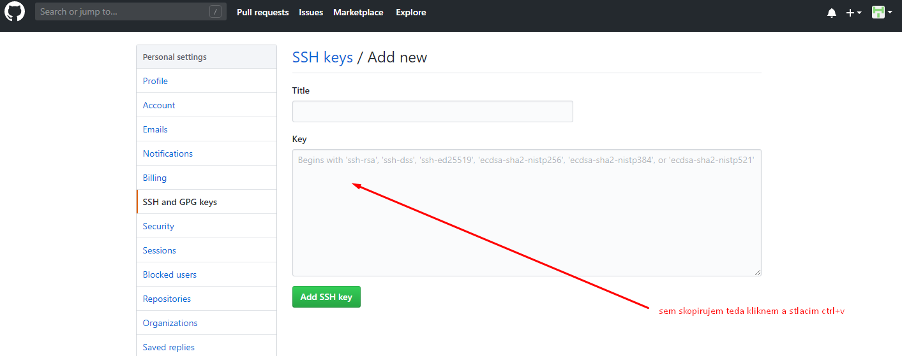
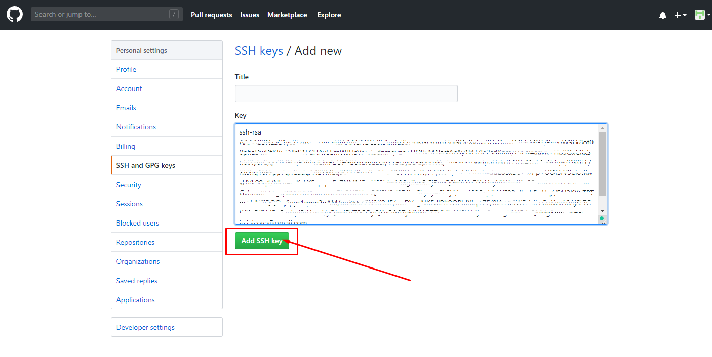

# Ako vygenerovat SSH kluc pre github

1. [info](https://help.github.com/en/articles/generating-a-new-ssh-key-and-adding-it-to-the-ssh-agent) otvorim si `git bash` terminal! a zadam tento prikaz v terminali, ktory vytvori verejny a privatny SSH klúč

```js
ssh-keygen -t rsa -b 4096 -C "your_email@example.com"
```

namiesto tohto emailu `"your_email@example.com"` zdam ten svoj vlastny, ktorý som použil pri registracii do githubu

2. tri krat stlačim enter nemusim nastavovat nič.
3. nasledne spustim tento prikaz
   `eval $(ssh-agent -s)`
   ktorý spusti agenta a priradi mu PID(Process ID)
4. potom spustim tento prikaz
   `ssh-add ~/.ssh/id_rsa`
   ktorý prida SSH kľúč k spustenemu agentovi
5. ďalší krok je pridať vygenerovaný SSH kľúč na svoj github učet [info](https://help.github.com/en/articles/adding-a-new-ssh-key-to-your-github-account), týmto príkazom si uložim do clipboardu(do dočasnej pamäte) náš vygenerovaný SSH kľúč
   `clip < ~/.ssh/id_rsa.pub`
6. postupo podľa obrazkov otvoriť si svoj github učet a kliknuť na profil ikonku
   
7. vramci menu kliknuť na nastavnia
   
8. vramci nastavenia kliknuť na SSH and GPG keys
   
9. kliknem na tlačitko ktorým pridam SSH kľúč
   
10. v tom druhom okne vložim cez `CTRL+V` svoj vygenerovaný SSH kľúč
    
11. a nakoniec potvrdím.
    

cesta, kde sa nachadzajú ssh kľúče

```
C:\Users\UserName\.ssh
```
